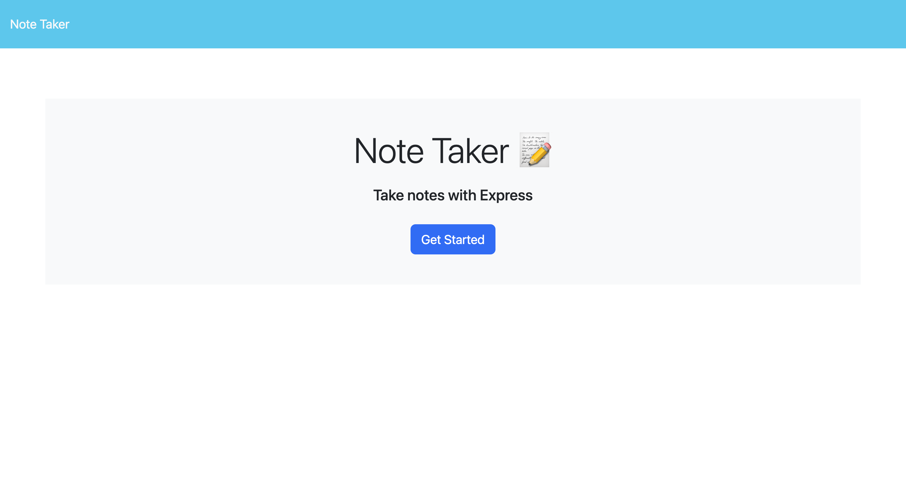
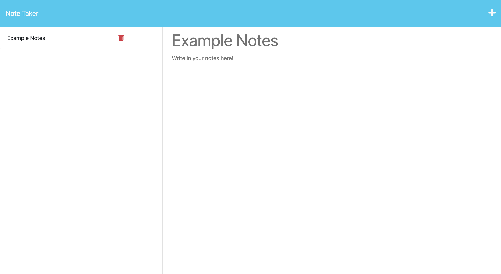

# Note-Taker


## Table of contents
* [Description](#description)
* [Heroku Link](#heroku-link)
* [Video](#video)
* [Installation](#installation)
* [Usage](#usage)
* [Screenshots](#screenshots)
* [Credits](#credits)
* [Contact Me](#contact-me)
* [License](#license)

## Description

The Note Taker app uses Express.js framework to create, save, and delete notes. 

## Heroku Link

https://express-note-taker-2023.herokuapp.com/

## Video

https://user-images.githubusercontent.com/115323708/213606685-b3629f54-113e-43d7-8c43-3c2bc7e3d836.mp4

## Installation

To install the Note Taker App, follow the steps below:

1. Clone the repository
 - https://github.com/JagpreetRandio/Note-Taker

2. Install the Dependencies 

``` npm i ```


## Usage 

Make sure you have all of the packages installed before starting this step! 

After entering the line of code below in your terminal, you will be directed to copy "http://localhost:3002" in your browser to use the Note Taker App.  

```npm start ```


## Screenshots

 
 

## Credits

N/A

## Contact Me

Jagpreet Randio - jagpreet9219@gmail.com

Github - https://github.com/JagpreetRandio


## License

MIT License